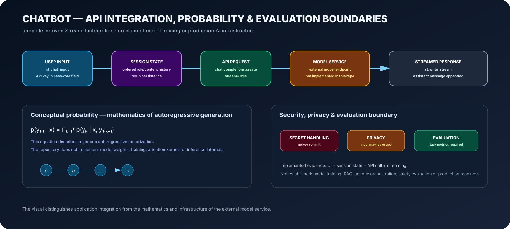

# Streamlit Chatbot — API Integration Learning Artifact

<p align="center"></p>

This repository demonstrates a **Streamlit + external model API integration pattern**: UI, session state, request construction and streamed responses.

## Mathematics shown in the visual

A generic autoregressive factorization is

```math
p(y_{1:T}\mid x)=\prod_{t=1}^{T}p(y_t\mid x,y_{1:t-1}).
```

That equation explains the probability structure conceptually. **The repository does not implement model weights, training, attention kernels or inference internals.**

## Implemented path

`user input → Streamlit session state → API client → external model service → streamed response → stored assistant turn`

The committed code uses a historical hard-coded model configuration and should be checked against current API documentation before execution.

## Security / evaluation boundary

No API key should be committed. A production system would require secret management, authentication, rate/cost controls, logging/privacy rules, dependency security and systematic model evaluation.

This repository does **not** establish model training, RAG, agents, production security, factuality, domain accuracy or safety performance.

```bash
python -m venv .venv
source .venv/bin/activate
pip install -r requirements.txt
streamlit run streamlit_app.py
```

> **Integration evidence is reported as integration evidence—not as original model development.**
